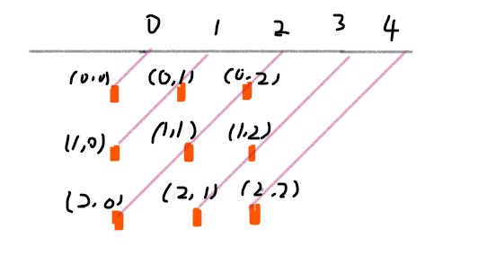

<!-- GFM-TOC -->
* [算法思想](#算法思想)
    * [二分查找](#二分查找)
    * [贪心思想](#贪心思想)
    * [双指针](#双指针)
    * [排序](#排序)
        * [快速选择](#快速选择)
        * [堆排序](#堆排序)
        * [桶排序](#桶排序)
        * [荷兰国旗问题](#荷兰国旗问题)
    * [搜索](#搜索)
        * [BFS](#bfs)
        * [DFS](#dfs)
        * [Backtracking](#backtracking)
    * [分治](#分治)
    * [动态规划](#动态规划)
        * [斐波那契数列](#斐波那契数列)
        * [最长递增子序列](#最长递增子序列)
        * [最长公共子序列](#最长公共子序列)
        * [0-1 背包](#0-1-背包)
        * [数组区间](#数组区间)
        * [字符串编辑](#字符串编辑)
        * [分割整数](#分割整数)
        * [矩阵路径](#矩阵路径)
        * [其它问题](#其它问题)
    * [数学](#数学)
        * [素数](#素数)
        * [最大公约数](#最大公约数)
        * [进制转换](#进制转换)
        * [阶乘](#阶乘)
        * [字符串加法减法](#字符串加法减法)
        * [相遇问题](#相遇问题)
        * [多数投票问题](#多数投票问题)
        * [其它](#其它)
* [数据结构相关](#数据结构相关)
    * [栈和队列](#栈和队列)
    * [哈希表](#哈希表)
    * [字符串](#字符串)
    * [数组与矩阵](#数组与矩阵)
    * [链表](#链表)
    * [树](#树)
        * [递归](#递归)
        * [层次遍历](#层次遍历)
        * [前中后序遍历](#前中后序遍历)
        * [BST](#bst)
        * [Trie](#trie)
    * [图](#图)
        * [二分图](#二分图)
        * [拓扑排序](#拓扑排序)
        * [并查集](#并查集)
    * [位运算](#位运算)
* [参考资料](#参考资料)
<!-- GFM-TOC -->


# 算法思想

## 二分查找

**正常实现** 

```java
public int binarySearch(int[] nums, int key) {
    int l = 0, h = nums.length - 1;
    while (l <= h) {
        int m = l + (h - l) / 2;
        if (nums[m] == key)
            return m;
        else if (nums[m] > key)
            h = m - 1;
        else
            l = m + 1;
    }
    return -1;
}
```

**时间复杂度** 

O(logN)

**计算 mid** 

有两种计算 mid 的方式：

- mid = (l + h) / 2
- mid = l + (h - l) / 2

l + h 可能出现加法溢出，最好使用第二种方式。

**返回值** 

循环退出时如果仍然没有查找到 key，那么表示查找失败。可以有两种返回值：

- -1：以一个错误码指示没有查找到 key
- l：将 key 插入到 nums 中的正确位置

**变种** 

二分查找可以有很多变种，变种实现要多注意边界值的判断。例如在一个有重复元素的数组中查找 key 的最左位置的实现如下：

```java
public int binarySearch(int[] nums, int key) {
    int l = 0, h = nums.length - 1;
    while (l < h) {
        int m = l + (h - l) / 2;
        if (nums[m] >= key)
            h = m;
        else
            l = m + 1;
    }
    return l;
}
```

该实现和正常实现有以下不同：

- 循环条件为 l < h
- h 的赋值表达式为 h = m
- 最后返回 l 而不是 -1

在 nums[m] >= key 的情况下，可以推导出最左 key 位于 [l, m] 区间中，这是一个闭区间。h 的赋值表达式为 h = m，因为 m 位置也可能是解。

在 h 的赋值表达式为 h = mid 的情况下，如果循环条件为 l <= h，那么会出现循环无法退出的情况，因此循环条件只能是 l < h。

```text
nums = {0, 1}, key = 0
l   m   h
0   1   2  nums[m] >= key
0   0   1  nums[m] >= key
0   0   0  nums[m] >= key
0   0   0  nums[m] >= key
...
```

当循环体退出时，不表示没有查找到 key，因此最后返回的结果不应该为 -1。为了验证有没有查找到，需要在调用端判断一下返回位置上的值和 key 是否相等。

**求开方** 

[69. Sqrt(x) (Easy)](https://leetcode.com/problems/sqrtx/description/)

```html
Input: 4
Output: 2

Input: 8
Output: 2
Explanation: The square root of 8 is 2.82842..., and since we want to return an integer, the decimal part will be truncated.
```

一个数 x 的开方 sqrt 一定在 0 \~ x 之间，并且满足 sqrt == x / sqrt。可以利用二分查找在 0 \~ x 之间查找 sqrt。

对于 x = 8，它的开方是 2.82842...，最后应该返回 2 而不是 3。在循环条件为 l <= h 并且循环退出时，h 总是比 l 小 1，也就是说 h = 2，l = 3，因此最后的返回值应该为 h 而不是 l。

```java
public int mySqrt(int x) {
    if (x <= 1)
        return x;
    int l = 1, h = x;
    while (l <= h) {
        int mid = l + (h - l) / 2;
        int sqrt = x / mid;
        if (sqrt == mid)
            return mid;
        else if (sqrt < mid)
            h = mid - 1;
        else
            l = mid + 1;
    }
    return h;
}
```

**大于给定元素的最小元素** 

[744. Find Smallest Letter Greater Than Target (Easy)](https://leetcode.com/problems/find-smallest-letter-greater-than-target/description/)

```html
Input:
letters = ["c", "f", "j"]
target = "d"
Output: "f"

Input:
letters = ["c", "f", "j"]
target = "k"
Output: "c"
```

题目描述：给定一个有序的字符数组 letters 和一个字符 target，要求找出 letters 中大于 target 的最小字符。letters 字符数组是循环数组。

应该注意最后返回的是 l 位置的字符。

```java
public char nextGreatestLetter(char[] letters, char target) {
    int n = letters.length;
    int l = 0, h = n - 1;
    while (l <= h) {
        int m = l + (h - l) / 2;
        if (letters[m] <= target)
            l = m + 1;
        else
            h = m - 1;
    }
    return l < n ? letters[l] : letters[0];
}
```

**有序数组的 Single Element** 

[540. Single Element in a Sorted Array (Medium)](https://leetcode.com/problems/single-element-in-a-sorted-array/description/)

```html
Input: [1,1,2,3,3,4,4,8,8]
Output: 2
```

题目描述：一个有序数组只有一个数不出现两次，找出这个数。要求以 O(logN) 时间复杂度进行求解。

令 key 为 Single Element 在数组中的位置。如果 m 为偶数，并且 m + 1 < key，那么 nums[m] == nums[m + 1]；m + 1 >= key，那么 nums[m] != nums[m + 1]。

从上面的规律可以知道，如果 nums[m] == nums[m + 1]，那么 key 所在的数组位置为 [m + 2, h]，此时令 l = m + 2；如果 nums[m] != nums[m + 1]，那么 key 所在的数组位置为 [l, m]，此时令 h = m。

因为 h 的赋值表达式为 h = m，那么循环条件也就只能使用 l < h 这种形式。

```java
public int singleNonDuplicate(int[] nums) {
    int l = 0, h = nums.length - 1;
    while (l < h) {
        int m = l + (h - l) / 2;
        if (m % 2 == 1)
            m--;   // 保证 l/h/m 都在偶数位，使得查找区间大小一直都是奇数
        if (nums[m] == nums[m + 1])
            l = m + 2;
        else
            h = m;
    }
    return nums[l];
}
```

**第一个错误的版本** 

[278. First Bad Version (Easy)](https://leetcode.com/problems/first-bad-version/description/)

题目描述：给定一个元素 n 代表有 [1, 2, ..., n] 版本，可以调用 isBadVersion(int x) 知道某个版本是否错误，要求找到第一个错误的版本。

如果第 m 个版本出错，则表示第一个错误的版本在 [l, m] 之间，令 h = m；否则第一个错误的版本在 [m + 1, h] 之间，令 l = m + 1。

因为 h 的赋值表达式为 h = m，因此循环条件为 l < h。

```java
public int firstBadVersion(int n) {
    int l = 1, h = n;
    while (l < h) {
        int mid = l + (h - l) / 2;
        if (isBadVersion(mid))
            h = mid;
        else
            l = mid + 1;
    }
    return l;
}
```

**旋转数组的最小数字** 

[153. Find Minimum in Rotated Sorted Array (Medium)](https://leetcode.com/problems/find-minimum-in-rotated-sorted-array/description/)

```html
Input: [3,4,5,1,2],
Output: 1
```

```java
public int findMin(int[] nums) {
    int l = 0, h = nums.length - 1;
    while (l < h) {
        int m = l + (h - l) / 2;
        if (nums[m] <= nums[h])
            h = m;
        else
            l = m + 1;
    }
    return nums[l];
}
```

**查找区间** 

[34. Search for a Range (Medium)](https://leetcode.com/problems/search-for-a-range/description/)

```html
Input: nums = [5,7,7,8,8,10], target = 8
Output: [3,4]

Input: nums = [5,7,7,8,8,10], target = 6
Output: [-1,-1]
```

```java
public int[] searchRange(int[] nums, int target) {
    int first = binarySearch(nums, target);
    int last = binarySearch(nums, target + 1) - 1;
    if (first == nums.length || nums[first] != target)
        return new int[]{-1, -1};
    else
        return new int[]{first, Math.max(first, last)};
}

private int binarySearch(int[] nums, int target) {
    int l = 0, h = nums.length; // 注意 h 的初始值
    while (l < h) {
        int m = l + (h - l) / 2;
        if (nums[m] >= target)
            h = m;
        else
            l = m + 1;
    }
    return l;
}
```

## 贪心思想

贪心思想保证每次操作都是局部最优的，并且最后得到的结果是全局最优的。

**分配饼干** 

[455. Assign Cookies (Easy)](https://leetcode.com/problems/assign-cookies/description/)

```html
Input: [1,2], [1,2,3]
Output: 2

Explanation: You have 2 children and 3 cookies. The greed factors of 2 children are 1, 2.
You have 3 cookies and their sizes are big enough to gratify all of the children,
You need to output 2.
```

题目描述：每个孩子都有一个满足度，每个饼干都有一个大小，只有饼干的大小大于等于一个孩子的满足度，该孩子才会获得满足。求解最多可以获得满足的孩子数量。

因为最小的孩子最容易得到满足，因此先满足最小孩子。给一个孩子的饼干应当尽量小又能满足该孩子，这样大饼干就能拿来给满足度比较大的孩子。

证明：假设在某次选择中，贪心策略选择给第 i 个孩子分配第 m 个饼干，并且第 i 个孩子满足度最小，第 m 个饼干为可以满足第 i 个孩子的最小饼干。假设最优策略在这次选择中给 i 个孩子分配第 n 个饼干，并且这个饼干大于第 m 个饼干。我们发现使用第 m 个饼干去替代第 n 个饼干完全不影响后续的结果，因此不存在比贪心策略更优的策略，即贪心策略就是最优策略。

```java
public int findContentChildren(int[] g, int[] s) {
    Arrays.sort(g);
    Arrays.sort(s);
    int gIndex = 0, sIndex = 0;
    while (gIndex < g.length && sIndex < s.length) {
        if (g[gIndex] <= s[sIndex])
            gIndex++;
        sIndex++;
    }
    return gIndex;
}
```

**股票的最大收益** 

[122. Best Time to Buy and Sell Stock II (Easy)](https://leetcode.com/problems/best-time-to-buy-and-sell-stock-ii/description/)

题目描述：一次交易包含买入和卖出，多个交易之间不能交叉进行。

对于 [a, b, c, d]，如果有 a <= b <= c <= d ，那么最大收益为 d - a。而 d - a = (d - c) + (c - b) + (b - a) ，因此当访问到一个 prices[i] 且 prices[i] - prices[i-1] > 0，那么就把 prices[i] - prices[i-1] 添加到收益中，从而在局部最优的情况下也保证全局最优。

```java
public int maxProfit(int[] prices) {
    int profit = 0;
    for (int i = 1; i < prices.length; i++)
        if (prices[i] > prices[i - 1])
            profit += (prices[i] - prices[i - 1]);

    return profit;
}
```

**种植花朵** 

[605. Can Place Flowers (Easy)](https://leetcode.com/problems/can-place-flowers/description/)

```html
Input: flowerbed = [1,0,0,0,1], n = 1
Output: True
```

题目描述：花朵之间至少需要一个单位的间隔，求解是否能种下 n 朵花。

```java
public boolean canPlaceFlowers(int[] flowerbed, int n) {
    int len = flowerbed.length;
    int cnt = 0;
    for (int i = 0; i < len; i++) {
        if (flowerbed[i] == 1)
            continue;
        int pre = i == 0 ? 0 : flowerbed[i - 1];
        int next = i == len - 1 ? 0 : flowerbed[i + 1];
        if (pre == 0 && next == 0) {
            cnt++;
            flowerbed[i] = 1;
        }
    }
    return cnt >= n;
}
```

**修改一个数成为非递减数组** 

[665. Non-decreasing Array (Easy)](https://leetcode.com/problems/non-decreasing-array/description/)

```html
Input: [4,2,3]
Output: True
Explanation: You could modify the first 4 to 1 to get a non-decreasing array.
```

题目描述：判断一个数组能不能只修改一个数就成为非递减数组。

在出现 nums[i] < nums[i - 1] 时，需要考虑的是应该修改数组的哪个数，使得本次修改能使 i 之前的数组成为非递减数组，并且  **不影响后续的操作** 。优先考虑令 nums[i - 1] = nums[i]，因为如果修改 nums[i] = nums[i - 1] 的话，那么 nums[i] 这个数会变大，就有可能比 nums[i + 1] 大，从而影响了后续操作。还有一个比较特别的情况就是 nums[i] < nums[i - 2]，只修改 nums[i - 1] = nums[i] 不能使数组成为非递减数组，只能修改 nums[i] = nums[i - 1]。

```java
public boolean checkPossibility(int[] nums) {
    int cnt = 0;
    for (int i = 1; i < nums.length && cnt < 2; i++) {
        if (nums[i] >= nums[i - 1])
            continue;
        cnt++;
        if (i - 2 >= 0 && nums[i - 2] > nums[i])
            nums[i] = nums[i - 1];
        else
            nums[i - 1] = nums[i];
    }
    return cnt <= 1;
}
```

**判断是否为子串** 

[392. Is Subsequence (Medium)](https://leetcode.com/problems/is-subsequence/description/)

```html
s = "abc", t = "ahbgdc"
Return true.
```

```java
public boolean isSubsequence(String s, String t) {
    int index = -1;
    for (char c : s.toCharArray()) {
        index = t.indexOf(c, index + 1);
        if (index == -1)
            return false;
    }
    return true;
}
```

**不重叠的区间个数** 

[435. Non-overlapping Intervals (Medium)](https://leetcode.com/problems/non-overlapping-intervals/description/)

```html
Input: [ [1,2], [1,2], [1,2] ]

Output: 2

Explanation: You need to remove two [1,2] to make the rest of intervals non-overlapping.
```

```html
Input: [ [1,2], [2,3] ]

Output: 0

Explanation: You don't need to remove any of the intervals since they're already non-overlapping.
```

题目描述：计算让一组区间不重叠所需要移除的区间个数。

直接计算最多能组成的不重叠区间个数即可。

在每次选择中，区间的结尾最为重要，选择的区间结尾越小，留给后面的区间的空间越大，那么后面能够选择的区间个数也就越大。

按区间的结尾进行排序，每次选择结尾最小，并且和前一个区间不重叠的区间。

```java
public int eraseOverlapIntervals(Interval[] intervals) {
    if (intervals.length == 0)
        return 0;
    Arrays.sort(intervals, Comparator.comparingInt(o -> o.end));
    int cnt = 1;
    int end = intervals[0].end;
    for (int i = 1; i < intervals.length; i++) {
        if (intervals[i].start < end)
            continue;
        end = intervals[i].end;
        cnt++;
    }
    return intervals.length - cnt;
}
```

**投飞镖刺破气球** 

[452. Minimum Number of Arrows to Burst Balloons (Medium)](https://leetcode.com/problems/minimum-number-of-arrows-to-burst-balloons/description/)

```
Input:
[[10,16], [2,8], [1,6], [7,12]]

Output:
2
```

题目描述：气球在一个水平数轴上摆放，可以重叠，飞镖垂直投向坐标轴，使得路径上的气球都会刺破。求解最小的投飞镖次数使所有气球都被刺破。

也是计算不重叠的区间个数，不过和 Non-overlapping Intervals 的区别在于，[1, 2] 和 [2, 3] 在本题中算是重叠区间。

```java
public int findMinArrowShots(int[][] points) {
    if (points.length == 0)
        return 0;

    Arrays.sort(points, Comparator.comparingInt(o -> o[1]));

    int cnt = 1, end = points[0][1];
    for (int i = 1; i < points.length; i++) {
        if (points[i][0] <= end) // [1,2] 和 [2,3] 算重叠
            continue;
        cnt++;
        end = points[i][1];
    }
    return cnt;
}
```


**分隔字符串使同种字符出现在一起** 

[763. Partition Labels (Medium)](https://leetcode.com/problems/partition-labels/description/)

```html
Input: S = "ababcbacadefegdehijhklij"
Output: [9,7,8]
Explanation:
The partition is "ababcbaca", "defegde", "hijhklij".
This is a partition so that each letter appears in at most one part.
A partition like "ababcbacadefegde", "hijhklij" is incorrect, because it splits S into less parts.
```

```java
 public List<Integer> partitionLabels(String S) {
     int[] lastIndexs = new int[26];
     for (int i = 0; i < S.length(); i++)
         lastIndexs[S.charAt(i) - 'a'] = i;

     List<Integer> ret = new ArrayList<>();
     int firstIndex = 0;
     while (firstIndex < S.length()) {
         int lastIndex = firstIndex;
         for (int i = firstIndex; i < S.length() && i <= lastIndex; i++) {
             int index = lastIndexs[S.charAt(i) - 'a'];
             if (index > lastIndex)
                 lastIndex = index;
         }
         ret.add(lastIndex - firstIndex + 1);
         firstIndex = lastIndex + 1;
     }
     return ret;
 }
```

**根据身高和序号重组队列** 

[406. Queue Reconstruction by Height(Medium)](https://leetcode.com/problems/queue-reconstruction-by-height/description/)

```html
Input:
[[7,0], [4,4], [7,1], [5,0], [6,1], [5,2]]

Output:
[[5,0], [7,0], [5,2], [6,1], [4,4], [7,1]]
```

题目描述：一个学生用两个分量 (h, k) 描述，h 表示身高，k 表示排在前面的有 k 个学生的身高比他高或者和他一样高。

为了在每次插入操作时不影响后续的操作，身高较高的学生应该先做插入操作，否则身高较小的学生原先正确插入第 k 个位置可能会变成第 k+1 个位置。

身高降序、k 值升序，然后按排好序的顺序插入队列的第 k 个位置中。

```java
public int[][] reconstructQueue(int[][] people) {
    if (people == null || people.length == 0 || people[0].length == 0)
        return new int[0][0];

    Arrays.sort(people, (a, b) -> (a[0] == b[0] ? a[1] - b[1] : b[0] - a[0]));

    List<int[]> queue = new ArrayList<>();

    for (int[] p : people)
        queue.add(p[1], p);

    return queue.toArray(new int[queue.size()][]);
}
```

## 双指针

双指针主要用于遍历数组，两个指针指向不同的元素，从而协同完成任务。

**有序数组的 Tow Sum** 

[Leetcode ：167. Two Sum II - Input array is sorted (Easy)](https://leetcode.com/problems/two-sum-ii-input-array-is-sorted/description/)

```html
Input: numbers={2, 7, 11, 15}, target=9
Output: index1=1, index2=2
```

题目描述：在有序数组中找出两个数，使它们的和为 target。

使用双指针，一个指针指向值较小的元素，一个指针指向值较大的元素。指向较小元素的指针从头向尾遍历，指向较大元素的指针从尾向头遍历。

如果两个指针指向元素的和 sum == target，那么得到要求的结果；如果 sum > target，移动较大的元素，使 sum 变小一些；如果 sum < target，移动较小的元素，使 sum 变大一些。

```java
public int[] twoSum(int[] numbers, int target) {
    int i = 0, j = numbers.length - 1;
    while (i < j) {
        int sum = numbers[i] + numbers[j];
        if (sum == target)
            return new int[]{i + 1, j + 1};
        else if (sum < target)
            i++;
        else
            j--;
    }
    return null;
}
```

**两数平方和** 

[633. Sum of Square Numbers (Easy)](https://leetcode.com/problems/sum-of-square-numbers/description/)

```html
Input: 5
Output: True
Explanation: 1 * 1 + 2 * 2 = 5
```

题目描述：判断一个数是否为两个数的平方和，例如 5 = 1<sup>2</sup> + 2<sup>2</sup>。

```java
public boolean judgeSquareSum(int c) {
    int i = 0, j = (int) Math.sqrt(c);
    while (i <= j) {
        int powSum = i * i + j * j;
        if (powSum == c)
            return true;
        if (powSum > c)
            j--;
        else
            i++;
    }
    return false;
}
```

**反转字符串中的元音字符** 

[345. Reverse Vowels of a String (Easy)](https://leetcode.com/problems/reverse-vowels-of-a-string/description/)

```html
Given s = "leetcode", return "leotcede".
```

使用双指针，指向待反转的两个元音字符，一个指针从头向尾遍历，一个指针从尾到头遍历。

```java
private HashSet<Character> vowels = new HashSet<>(Arrays.asList('a', 'e', 'i', 'o', 'u', 'A', 'E', 'I', 'O', 'U'));

public String reverseVowels(String s) {
    int i = 0, j = s.length() - 1;
    char[] result = new char[s.length()];
    while (i <= j) {
        char ci = s.charAt(i);
        char cj = s.charAt(j);
        if (!vowels.contains(ci))
            result[i++] = ci;
        else if (!vowels.contains(cj))
            result[j--] = cj;
        else {
            result[i++] = cj;
            result[j--] = ci;
        }
    }
    return new String(result);
}
```

**回文字符串** 

[680. Valid Palindrome II (Easy)](https://leetcode.com/problems/valid-palindrome-ii/description/)

```html
Input: "abca"
Output: True
Explanation: You could delete the character 'c'.
```

题目描述：可以删除一个字符，判断是否能构成回文字符串。

```java
public boolean validPalindrome(String s) {
    int i = -1, j = s.length();
    while (++i < --j)
        if (s.charAt(i) != s.charAt(j))
            return isPalindrome(s, i, j - 1) || isPalindrome(s, i + 1, j);

    return true;
}

private boolean isPalindrome(String s, int i, int j) {
    while (i < j)
        if (s.charAt(i++) != s.charAt(j--))
            return false;

    return true;
}
```

**归并两个有序数组** 

[88. Merge Sorted Array (Easy)](https://leetcode.com/problems/merge-sorted-array/description/)

```html
Input:
nums1 = [1,2,3,0,0,0], m = 3
nums2 = [2,5,6],       n = 3

Output: [1,2,2,3,5,6]
```

题目描述：把归并结果存到第一个数组上。

```java
public void merge(int[] nums1, int m, int[] nums2, int n) {
    // 需要从尾开始遍历，否则在 nums1 上归并得到的值会覆盖还未进行归并比较的值
    int i = m - 1, j = n - 1;
    int index = m + n - 1;
    while (i >= 0 || j >= 0) {
        if (i < 0)
            nums1[index] = nums2[j--];
        else if (j < 0)
            nums1[index] = nums1[i--];
        else if (nums1[i] > nums2[j])
            nums1[index] = nums1[i--];
        else
            nums1[index] = nums2[j--];
        index--;
    }
}
```

**判断链表是否存在环** 

[141. Linked List Cycle (Easy)](https://leetcode.com/problems/linked-list-cycle/description/)

使用双指针，一个指针每次移动一个节点，一个指针每次移动两个节点，如果存在环，那么这两个指针一定会相遇。

```java
public boolean hasCycle(ListNode head) {
    if (head == null)
        return false;
    ListNode l1 = head, l2 = head.next;
    while (l1 != null && l2 != null && l2.next != null) {
        if (l1 == l2)
            return true;
        l1 = l1.next;
        l2 = l2.next.next;
    }
    return false;
}
```

**最长子序列** 

[524. Longest Word in Dictionary through Deleting (Medium)](https://leetcode.com/problems/longest-word-in-dictionary-through-deleting/description/)

```
Input:
s = "abpcplea", d = ["ale","apple","monkey","plea"]

Output:
"apple"
```

题目描述：删除 s 中的一些字符，使得它构成字符串列表 d 中的一个字符串，找出能构成的最长字符串。如果有多个相同长度的结果，返回按字典序排序的最大字符串。

```java
public String findLongestWord(String s, List<String> d) {
    String longestWord = "";
    for (String target : d) {
        int l1 = longestWord.length(), l2 = target.length();
        if (l1 > l2 || (l1 == l2 && longestWord.compareTo(target) < 0))
            continue;
        if (isValid(s, target))
            longestWord = target;
    }
    return longestWord;
}

private boolean isValid(String s, String target) {
    int i = 0, j = 0;
    while (i < s.length() && j < target.length()) {
        if (s.charAt(i) == target.charAt(j))
            j++;
        i++;
    }
    return j == target.length();
}
```

## 排序

### 快速选择

一般用于求解  **Kth Element**  问题，可以在 O(N) 时间复杂度，O(1) 空间复杂度完成求解工作。

与快速排序一样，快速选择一般需要先打乱数组，否则最坏情况下时间复杂度为 O(N<sup>2</sup>)。

### 堆排序

堆排序用于求解  **TopK Elements**  问题，通过维护一个大小为 K 的堆，堆中的元素就是 TopK Elements。当然它也可以用于求解 Kth Element 问题，堆顶元素就是 Kth Element。快速选择也可以求解 TopK Elements 问题，因为找到 Kth Element 之后，再遍历一次数组，所有小于等于 Kth Element 的元素都是 TopK Elements。可以看到，快速选择和堆排序都可以求解 Kth Element 和 TopK Elements 问题。

**Kth Element** 

[215. Kth Largest Element in an Array (Medium)](https://leetcode.com/problems/kth-largest-element-in-an-array/description/)

**排序** ：时间复杂度 O(NlogN)，空间复杂度 O(1)

```java
public int findKthLargest(int[] nums, int k) {
    Arrays.sort(nums);
    return nums[nums.length - k];
}
```

**堆排序** ：时间复杂度 O(NlogK)，空间复杂度 O(K)。

```java
public int findKthLargest(int[] nums, int k) {
    PriorityQueue<Integer> pq = new PriorityQueue<>(); // 小顶堆
    for (int val : nums) {
        pq.add(val);
        if (pq.size() > k) // 维护堆的大小为 K
            pq.poll();
    }
    return pq.peek();
}
```

**快速选择** ：时间复杂度 O(N)，空间复杂度 O(1)

```java
public int findKthLargest(int[] nums, int k) {
    k = nums.length - k;
    int l = 0, h = nums.length - 1;
    while (l < h) {
        int j = partition(nums, l, h);
        if (j == k)
            break;
        else if (j < k)
            l = j + 1;
        else
            h = j - 1;
    }
    return nums[k];
}

private int partition(int[] a, int l, int h) {
    int i = l, j = h + 1;
    while (true) {
        while (a[++i] < a[l] && i < h) ;
        while (a[--j] > a[l] && j > l) ;
        if (i >= j)
            break;
        swap(a, i, j);
    }
    swap(a, l, j);
    return j;
}

private void swap(int[] a, int i, int j) {
    int t = a[i];
    a[i] = a[j];
    a[j] = t;
}
```

### 桶排序

**出现频率最多的 k 个数** 

[347. Top K Frequent Elements (Medium)](https://leetcode.com/problems/top-k-frequent-elements/description/)

```html
Given [1,1,1,2,2,3] and k = 2, return [1,2].
```

设置若干个桶，每个桶存储出现频率相同的数，并且桶的下标代表桶中数出现的频率，即第 i 个桶中存储的数出现的频率为 i。把数都放到桶之后，从后向前遍历桶，最先得到的 k 个数就是出现频率最多的的 k 个数。

```java
public List<Integer> topKFrequent(int[] nums, int k) {
    Map<Integer, Integer> frequencyMap = new HashMap<>();
    for (int num : nums)
        frequencyMap.put(num, frequencyMap.getOrDefault(num, 0) + 1);

    List<Integer>[] bucket = new List[nums.length + 1];
    for (int key : frequencyMap.keySet()) {
        int frequency = frequencyMap.get(key);
        if (bucket[frequency] == null)
            bucket[frequency] = new ArrayList<>();
        bucket[frequency].add(key);
    }

    List<Integer> topK = new ArrayList<>();
    for (int i = bucket.length - 1; i >= 0 && topK.size() < k; i--)
        if (bucket[i] != null)
            topK.addAll(bucket[i]);

    return topK;
}
```

**按照字符出现次数对字符串排序** 

[451. Sort Characters By Frequency (Medium)](https://leetcode.com/problems/sort-characters-by-frequency/description/)

```html
Input:
"tree"

Output:
"eert"

Explanation:
'e' appears twice while 'r' and 't' both appear once.
So 'e' must appear before both 'r' and 't'. Therefore "eetr" is also a valid answer.
```

```java
public String frequencySort(String s) {
    Map<Character, Integer> frequencyMap = new HashMap<>();
    for (char c : s.toCharArray())
        frequencyMap.put(c, frequencyMap.getOrDefault(c, 0) + 1);

    List<Character>[] frequencyBucket = new List[s.length() + 1];
    for (char c : frequencyMap.keySet()) {
        int f = frequencyMap.get(c);
        if (frequencyBucket[f] == null)
            frequencyBucket[f] = new ArrayList<>();
        frequencyBucket[f].add(c);
    }
    StringBuilder str = new StringBuilder();
    for (int i = frequencyBucket.length - 1; i >= 0; i--) {
        if (frequencyBucket[i] == null)
            continue;
        for (char c : frequencyBucket[i])
            for (int j = 0; j < i; j++)
                str.append(c);
    }
    return str.toString();
}
```

### 荷兰国旗问题

荷兰国旗包含三种颜色：红、白、蓝。有这三种颜色的球，算法的目标是将这三种球按颜色顺序正确地排列。

它其实是三向切分快速排序的一种变种，在三向切分快速排序中，每次切分都将数组分成三个区间：小于切分元素、等于切分元素、大于切分元素，而该算法是将数组分成三个区间：等于红色、等于白色、等于蓝色。

<div align="center">  </div><br>

**按颜色进行排序** 

[75. Sort Colors (Medium)](https://leetcode.com/problems/sort-colors/description/)

```html
Input: [2,0,2,1,1,0]
Output: [0,0,1,1,2,2]
```

题目描述：只有 0/1/2 三种颜色。

```java
public void sortColors(int[] nums) {
    int zero = -1, one = 0, two = nums.length;
    while (one < two) {
        if (nums[one] == 0)
            swap(nums, ++zero, one++);
        else if (nums[one] == 2)
            swap(nums, --two, one);
        else
            ++one;
    }
}

private void swap(int[] nums, int i, int j) {
    int t = nums[i];
    nums[i] = nums[j];
    nums[j] = t;
}
```

## 搜索

深度优先搜索和广度优先搜索广泛运用于树和图中，但是它们的应用远远不止如此。

### BFS

<div align="center">  </div><br>

广度优先搜索的搜索过程有点像一层一层地进行遍历，每层遍历都以上一层遍历的结果作为起点，遍历一个距离能访问到的所有节点。需要注意的是，遍历过的节点不能再次被遍历。

第一层：

- 0 -> {6,2,1,5};

第二层：

- 6 -> {4}
- 2 -> {}
- 1 -> {}
- 5 -> {3}

第三层：

- 4 -> {}
- 3 -> {}

可以看到，每一轮遍历的节点都与根节点距离相同。设 d<sub>i</sub> 表示第 i 个节点与根节点的距离，推导出一个结论：对于先遍历的节点 i 与后遍历的节点 j，有 d<sub>i</sub><=d<sub>j</sub>。利用这个结论，可以求解最短路径等  **最优解**  问题：第一次遍历到目的节点，其所经过的路径为最短路径。应该注意的是，使用 BFS 只能求解无权图的最短路径。

在程序实现 BFS 时需要考虑以下问题：

- 队列：用来存储每一轮遍历得到的节点；
- 标记：对于遍历过的节点，应该将它标记，防止重复遍历。

**组成整数的最小平方数数量** 

[279. Perfect Squares (Medium)](https://leetcode.com/problems/perfect-squares/description/)

```html
For example, given n = 12, return 3 because 12 = 4 + 4 + 4; given n = 13, return 2 because 13 = 4 + 9.
```

可以将每个整数看成图中的一个节点，如果两个整数只差为一个平方数，那么这两个整数所在的节点就有一条边。

要求解最小的平方数数量，就是求解从节点 n 到节点 0 的最短路径。

本题也可以用动态规划求解，在之后动态规划部分中会再次出现。

```java
public int numSquares(int n) {
    List<Integer> squares = generateSquares(n);
    Queue<Integer> queue = new LinkedList<>();
    boolean[] marked = new boolean[n + 1];
    queue.add(n);
    marked[n] = true;
    int num = 0;
    while (!queue.isEmpty()) {
        int size = queue.size();
        num++;
        while (size-- > 0) {
            int cur = queue.poll();
            for (int s : squares) {
                int next = cur - s;
                if (next < 0)
                    break;
                if (next == 0)
                    return num;
                if (marked[next])
                    continue;
                marked[next] = true;
                queue.add(cur - s);
            }
        }
    }
    return n;
}

private List<Integer> generateSquares(int n) {
    List<Integer> squares = new ArrayList<>();
    int square = 1;
    int diff = 3;
    while (square <= n) {
        squares.add(square);
        square += diff;
        diff += 2;
    }
    return squares;
}
```

**最短单词路径** 

[127. Word Ladder (Medium)](https://leetcode.com/problems/word-ladder/description/)

```html
Input:
beginWord = "hit",
endWord = "cog",
wordList = ["hot","dot","dog","lot","log","cog"]

Output: 5

Explanation: As one shortest transformation is "hit" -> "hot" -> "dot" -> "dog" -> "cog",
return its length 5.
```

```html
Input:
beginWord = "hit"
endWord = "cog"
wordList = ["hot","dot","dog","lot","log"]

Output: 0

Explanation: The endWord "cog" is not in wordList, therefore no possible transformation.
```

题目描述：要找出一条从 beginWord 到 endWord 的最短路径，每次移动规定为改变一个字符，并且改变之后的字符串必须在 wordList 中。

```java
public int ladderLength(String beginWord, String endWord, List<String> wordList) {
    wordList.add(beginWord);
    int N = wordList.size();
    int start = N - 1;
    int end = 0;
    while (end < N && !wordList.get(end).equals(endWord))
        end++;
    if (end == N)
        return 0;
    List<Integer>[] graphic = buildGraphic(wordList);
    return getShortestPath(graphic, start, end);
}

private List<Integer>[] buildGraphic(List<String> wordList) {
    int N = wordList.size();
    List<Integer>[] graphic = new List[N];
    for (int i = 0; i < N; i++) {
        graphic[i] = new ArrayList<>();
        for (int j = 0; j < N; j++) {
            if (isConnect(wordList.get(i), wordList.get(j)))
                graphic[i].add(j);
        }
    }
    return graphic;
}

private boolean isConnect(String s1, String s2) {
    int diffCnt = 0;
    for (int i = 0; i < s1.length() && diffCnt <= 1; i++) {
        if (s1.charAt(i) != s2.charAt(i))
            diffCnt++;
    }
    return diffCnt == 1;
}

private int getShortestPath(List<Integer>[] graphic, int start, int end) {
    Queue<Integer> queue = new LinkedList<>();
    boolean[] marked = new boolean[graphic.length];
    queue.add(start);
    marked[start] = true;
    int path = 1;
    while (!queue.isEmpty()) {
        int size = queue.size();
        path++;
        while (size-- > 0) {
            int cur = queue.poll();
            for (int next : graphic[cur]) {
                if (next == end)
                    return path;
                if (marked[next])
                    continue;
                marked[next] = true;
                queue.add(next);
            }
        }
    }
    return 0;
}
```

### DFS

<div align="center">  </div><br>

广度优先搜索一层一层遍历，每一层得到的所有新节点，要用队列存储起来以备下一层遍历的时候再遍历。

而深度优先搜索在得到一个新节点时立马对新节点进行遍历：从节点 0 出发开始遍历，得到到新节点 6 时，立马对新节点 6 进行遍历，得到新节点 4；如此反复以这种方式遍历新节点，直到没有新节点了，此时返回。返回到根节点 0 的情况是，继续对根节点 0 进行遍历，得到新节点 2，然后继续以上步骤。

从一个节点出发，使用 DFS 对一个图进行遍历时，能够遍历到的节点都是从初始节点可达的，DFS 常用来求解这种  **可达性**  问题。

在程序实现 DFS 时需要考虑以下问题：

- 栈：用栈来保存当前节点信息，当遍历新节点返回时能够继续遍历当前节点。可以使用递归栈。
- 标记：和 BFS 一样同样需要对已经遍历过的节点进行标记。

**查找最大的连通面积** 

[695. Max Area of Island (Easy)](https://leetcode.com/problems/max-area-of-island/description/)

```
[[0,0,1,0,0,0,0,1,0,0,0,0,0],
 [0,0,0,0,0,0,0,1,1,1,0,0,0],
 [0,1,1,0,1,0,0,0,0,0,0,0,0],
 [0,1,0,0,1,1,0,0,1,0,1,0,0],
 [0,1,0,0,1,1,0,0,1,1,1,0,0],
 [0,0,0,0,0,0,0,0,0,0,1,0,0],
 [0,0,0,0,0,0,0,1,1,1,0,0,0],
 [0,0,0,0,0,0,0,1,1,0,0,0,0]]
```

```java
private int m, n;
private int[][] direction = {{0, 1}, {0, -1}, {1, 0}, {-1, 0}};

public int maxAreaOfIsland(int[][] grid) {
    if (grid == null || grid.length == 0)
        return 0;

    m = grid.length;
    n = grid[0].length;

    int maxArea = 0;
    for (int i = 0; i < m; i++)
        for (int j = 0; j < n; j++)
            maxArea = Math.max(maxArea, dfs(grid, i, j));

    return maxArea;
}

private int dfs(int[][] grid, int r, int c) {
    if (r < 0 || r >= m || c < 0 || c >= n || grid[r][c] == 0)
        return 0;

    grid[r][c] = 0;
    int area = 1;
    for (int[] d : direction)
        area += dfs(grid, r + d[0], c + d[1]);

    return area;
}
```

**矩阵中的连通分量数目** 

[200. Number of Islands (Medium)](https://leetcode.com/problems/number-of-islands/description/)

```html
Input:
11000
11000
00100
00011

Output: 3
```

可以将矩阵表示看成一张有向图。

```java
private int m, n;
private int[][] direction = {{0, 1}, {0, -1}, {1, 0}, {-1, 0}};

public int numIslands(char[][] grid) {
    if (grid == null || grid.length == 0)
        return 0;

    m = grid.length;
    n = grid[0].length;
    int islandsNum = 0;
    for (int i = 0; i < m; i++)
        for (int j = 0; j < n; j++)
            if (grid[i][j] != '0') {
                dfs(grid, i, j);
                islandsNum++;
            }

    return islandsNum;
}

private void dfs(char[][] grid, int i, int j) {
    if (i < 0 || i >= m || j < 0 || j >= n || grid[i][j] == '0')
        return;

    grid[i][j] = '0';
    for (int[] d : direction)
        dfs(grid, i + d[0], j + d[1]);
}
```

**好友关系的连通分量数目** 

[547. Friend Circles (Medium)](https://leetcode.com/problems/friend-circles/description/)

```html
Input:
[[1,1,0],
 [1,1,0],
 [0,0,1]]
Output: 2
Explanation:The 0th and 1st students are direct friends, so they are in a friend circle.
The 2nd student himself is in a friend circle. So return 2.
```

好友关系可以看成是一个无向图，例如第 0 个人与第 1 个人是好友，那么 M[0][1] 和 M[1][0] 的值都为 1。

```java
private int n;

public int findCircleNum(int[][] M) {
    n = M.length;
    int circleNum = 0;
    boolean[] hasVisited = new boolean[n];
    for (int i = 0; i < n; i++)
        if (!hasVisited[i]) {
            dfs(M, i, hasVisited);
            circleNum++;
        }

    return circleNum;
}

private void dfs(int[][] M, int i, boolean[] hasVisited) {
    hasVisited[i] = true;
    for (int k = 0; k < n; k++)
        if (M[i][k] == 1 && !hasVisited[k])
            dfs(M, k, hasVisited);
}
```

**填充封闭区域** 

[130. Surrounded Regions (Medium)](https://leetcode.com/problems/surrounded-regions/description/)

```html
For example,
X X X X
X O O X
X X O X
X O X X

After running your function, the board should be:
X X X X
X X X X
X X X X
X O X X
```

题目描述：使得被 'X' 包围的 'O' 转换为 'X'。

先填充最外侧，剩下的就是里侧了。

```java
private int[][] direction = {{0, 1}, {0, -1}, {1, 0}, {-1, 0}};
private int m, n;

public void solve(char[][] board) {
    if (board == null || board.length == 0)
        return;

    m = board.length;
    n = board[0].length;

    for (int i = 0; i < m; i++) {
        dfs(board, i, 0);
        dfs(board, i, n - 1);
    }
    for (int i = 0; i < n; i++) {
        dfs(board, 0, i);
        dfs(board, m - 1, i);
    }

    for (int i = 0; i < m; i++)
        for (int j = 0; j < n; j++) {
            if (board[i][j] == 'T')
                board[i][j] = 'O';
            else if (board[i][j] == 'O')
                board[i][j] = 'X';
        }
}

private void dfs(char[][] board, int r, int c) {
    if (r < 0 || r >= m || c < 0 || c >= n || board[r][c] != 'O')
        return;

    board[r][c] = 'T';
    for (int[] d : direction)
        dfs(board, r + d[0], c + d[1]);
}
```

**能到达的太平洋和大西洋的区域** 

[417. Pacific Atlantic Water Flow (Medium)](https://leetcode.com/problems/pacific-atlantic-water-flow/description/)

```html
Given the following 5x5 matrix:

  Pacific ~   ~   ~   ~   ~
       ~  1   2   2   3  (5) *
       ~  3   2   3  (4) (4) *
       ~  2   4  (5)  3   1  *
       ~ (6) (7)  1   4   5  *
       ~ (5)  1   1   2   4  *
          *   *   *   *   * Atlantic

Return:
[[0, 4], [1, 3], [1, 4], [2, 2], [3, 0], [3, 1], [4, 0]] (positions with parentheses in above matrix).
```

题目描述：左边和上边是太平洋，右边和下边是大西洋，内部的数字代表海拔，海拔高的地方的水能够流到低的地方，求解水能够流到太平洋和大西洋的所有位置。

```java
private int m, n;
private int[][] matrix;
private int[][] direction = {{0, 1}, {0, -1}, {1, 0}, {-1, 0}};

public List<int[]> pacificAtlantic(int[][] matrix) {
    List<int[]> ret = new ArrayList<>();
    if (matrix == null || matrix.length == 0)
        return ret;

    m = matrix.length;
    n = matrix[0].length;
    this.matrix = matrix;
    boolean[][] canReachP = new boolean[m][n];
    boolean[][] canReachA = new boolean[m][n];

    for (int i = 0; i < m; i++) {
        dfs(i, 0, canReachP);
        dfs(i, n - 1, canReachA);
    }
    for (int i = 0; i < n; i++) {
        dfs(0, i, canReachP);
        dfs(m - 1, i, canReachA);
    }

    for (int i = 0; i < m; i++)
        for (int j = 0; j < n; j++)
            if (canReachP[i][j] && canReachA[i][j])
                ret.add(new int[]{i, j});

    return ret;
}

private void dfs(int r, int c, boolean[][] canReach) {
    if (canReach[r][c])
        return;

    canReach[r][c] = true;
    for (int[] d : direction) {
        int nextR = d[0] + r;
        int nextC = d[1] + c;
        if (nextR < 0 || nextR >= m || nextC < 0 || nextC >= n || matrix[r][c] > matrix[nextR][nextC])
            continue;
        dfs(nextR, nextC, canReach);
    }
}
```

### Backtracking

Backtracking（回溯）属于 DFS。

- 普通 DFS 主要用在  **可达性问题** ，这种问题只需要执行到特点的位置然后返回即可。
- 而 Backtracking 主要用于求解  **排列组合**  问题，例如有 { 'a','b','c' } 三个字符，求解所有由这三个字符排列得到的字符串，这种问题在执行到特定的位置返回之后还会继续执行求解过程。

因为 Backtracking 不是立即就返回，而要继续求解，因此在程序实现时，需要注意对元素的标记问题：

- 在访问一个新元素进入新的递归调用时，需要将新元素标记为已经访问，这样才能在继续递归调用时不用重复访问该元素；
- 但是在递归返回时，需要将元素标记为未访问，因为只需要保证在一个递归链中不同时访问一个元素，可以访问已经访问过但是不在当前递归链中的元素。

**数字键盘组合** 

[17. Letter Combinations of a Phone Number (Medium)](https://leetcode.com/problems/letter-combinations-of-a-phone-number/description/)

<div align="center">  </div><br>

```html
Input:Digit string "23"
Output: ["ad", "ae", "af", "bd", "be", "bf", "cd", "ce", "cf"].
```

```java
private static final String[] KEYS = {"", "", "abc", "def", "ghi", "jkl", "mno", "pqrs", "tuv", "wxyz"};

public List<String> letterCombinations(String digits) {
    List<String> ret = new ArrayList<>();
    if (digits == null || digits.length() == 0)
        return ret;
    combination(new StringBuilder(), digits, ret);
    return ret;
}

private void combination(StringBuilder prefix, String digits, List<String> ret) {
    if (prefix.length() == digits.length()) {
        ret.add(prefix.toString());
        return;
    }
    String letters = KEYS[digits.charAt(prefix.length()) - '0'];
    for (char c : letters.toCharArray()) {
        prefix.append(c);                         // 添加
        combination(prefix, digits, ret);
        prefix.deleteCharAt(prefix.length() - 1); // 删除
    }
}
```

**IP 地址划分** 

[93. Restore IP Addresses(Medium)](https://leetcode.com/problems/restore-ip-addresses/description/)

```html
Given "25525511135",
return ["255.255.11.135", "255.255.111.35"].
```

```java
public List<String> restoreIpAddresses(String s) {
    List<String> addresses = new ArrayList<>();
    StringBuilder path = new StringBuilder();
    doRestore(0, path, s, addresses);
    return addresses;
}

private void doRestore(int k, StringBuilder path, String s, List<String> addresses) {
    if (k == 4 || s.length() == 0) {
        if (k == 4 && s.length() == 0)
            addresses.add(path.toString());
        return;
    }
    for (int i = 0; i < s.length() && i <= 2; i++) {
        if (i != 0 && s.charAt(0) == '0')
            break;
        String part = s.substring(0, i + 1);
        if (Integer.valueOf(part) <= 255) {
            if (path.length() != 0)
                part = "." + part;
            path.append(part);
            doRestore(k + 1, path, s.substring(i + 1), addresses);
            path.delete(path.length() - part.length(), path.length());
        }
    }
}
```

**在矩阵中寻找字符串** 

[79. Word Search (Medium)](https://leetcode.com/problems/word-search/description/)

```html
For example,
Given board =
[
  ['A','B','C','E'],
  ['S','F','C','S'],
  ['A','D','E','E']
]
word = "ABCCED", -> returns true,
word = "SEE", -> returns true,
word = "ABCB", -> returns false.
```

```java
private static int[][] direction = {{1, 0}, {-1, 0}, {0, 1}, {0, -1}};
private int m;
private int n;

public boolean exist(char[][] board, String word) {
    if (word == null || word.length() == 0)
        return true;
    if (board == null || board.length == 0 || board[0].length == 0)
        return false;

    m = board.length;
    n = board[0].length;
    boolean[][] visited = new boolean[m][n];

    for (int i = 0; i < m; i++)
        for (int j = 0; j < n; j++)
            if (backtracking(board, visited, word, 0, i, j)) return true;

    return false;
}

private boolean backtracking(char[][] board, boolean[][] visited, String word, int start, int r, int c) {
    if (start == word.length())
        return true;
    if (r < 0 || r >= m || c < 0 || c >= n || board[r][c] != word.charAt(start) || visited[r][c])
        return false;

    visited[r][c] = true;

    for (int[] d : direction)
        if (backtracking(board, visited, word, start + 1, r + d[0], c + d[1]))
            return true;

    visited[r][c] = false;

    return false;
}
```

**输出二叉树中所有从根到叶子的路径** 

[257. Binary Tree Paths (Easy)](https://leetcode.com/problems/binary-tree-paths/description/)

```html
  1
 /  \
2    3
 \
  5
```

```html
["1->2->5", "1->3"]
```

```java
public List<String> binaryTreePaths(TreeNode root) {
    List<String> paths = new ArrayList();
    if (root == null)
        return paths;
    List<Integer> values = new ArrayList<>();
    backtracking(root, values, paths);
    return paths;
}

private void backtracking(TreeNode node, List<Integer> values, List<String> paths) {
    if (node == null)
        return;
    values.add(node.val);
    if (isLeaf(node))
        paths.add(buildPath(values));
    else {
        backtracking(node.left, values, paths);
        backtracking(node.right, values, paths);
    }
    values.remove(values.size() - 1);
}

private boolean isLeaf(TreeNode node) {
    return node.left == null && node.right == null;
}

private String buildPath(List<Integer> values) {
    StringBuilder str = new StringBuilder();
    for (int i = 0; i < values.size(); i++) {
        str.append(values.get(i));
        if (i != values.size() - 1)
            str.append("->");
    }
    return str.toString();
}
```

**排列** 

[46. Permutations (Medium)](https://leetcode.com/problems/permutations/description/)

```html
[1,2,3] have the following permutations:
[
  [1,2,3],
  [1,3,2],
  [2,1,3],
  [2,3,1],
  [3,1,2],
  [3,2,1]
]
```

```java
public List<List<Integer>> permute(int[] nums) {
    List<List<Integer>> ret = new ArrayList<>();
    List<Integer> permuteList = new ArrayList<>();
    boolean[] visited = new boolean[nums.length];
    backtracking(permuteList, visited, nums, ret);
    return ret;
}

private void backtracking(List<Integer> permuteList, boolean[] visited, int[] nums, List<List<Integer>> ret) {
    if (permuteList.size() == nums.length) {
        ret.add(new ArrayList(permuteList)); // 重新构造一个 List
        return;
    }
    for (int i = 0; i < visited.length; i++) {
        if (visited[i])
            continue;
        visited[i] = true;
        permuteList.add(nums[i]);
        backtracking(permuteList, visited, nums, ret);
        permuteList.remove(permuteList.size() - 1);
        visited[i] = false;
    }
}
```

**含有相同元素求排列** 

[47. Permutations II (Medium)](https://leetcode.com/problems/permutations-ii/description/)

```html
[1,1,2] have the following unique permutations:
[[1,1,2], [1,2,1], [2,1,1]]
```

题目描述：数组元素可能含有相同的元素，进行排列时就有可能出现重复的排列，要求重复的排列只返回一个。

在实现上，和 Permutations 不同的是要先排序，然后在添加一个元素时，判断这个元素是否等于前一个元素，如果等于，并且前一个元素还未访问，那么就跳过这个元素。

```java
public List<List<Integer>> permuteUnique(int[] nums) {
    List<List<Integer>> ret = new ArrayList<>();
    List<Integer> permuteList = new ArrayList<>();
    Arrays.sort(nums);
    boolean[] visited = new boolean[nums.length];
    backtracking(permuteList, visited, nums, ret);
    return ret;
}

private void backtracking(List<Integer> permuteList, boolean[] visited, int[] nums, List<List<Integer>> ret) {
    if (permuteList.size() == nums.length) {
        ret.add(new ArrayList(permuteList));
        return;
    }

    for (int i = 0; i < visited.length; i++) {
        if (i != 0 && nums[i] == nums[i - 1] && !visited[i - 1])
            continue; // 防止重复
        if (visited[i])
            continue;
        visited[i] = true;
        permuteList.add(nums[i]);
        backtracking(permuteList, visited, nums, ret);
        permuteList.remove(permuteList.size() - 1);
        visited[i] = false;
    }
}
```

**组合** 

[77. Combinations (Medium)](https://leetcode.com/problems/combinations/description/)

```html
If n = 4 and k = 2, a solution is:
[
  [2,4],
  [3,4],
  [2,3],
  [1,2],
  [1,3],
  [1,4],
]
```

```java
public List<List<Integer>> combine(int n, int k) {
    List<List<Integer>> ret = new ArrayList<>();
    List<Integer> combineList = new ArrayList<>();
    backtracking(1, n, k, combineList, ret);
    return ret;
}

private void backtracking(int start, int n, int k, List<Integer> combineList, List<List<Integer>> ret) {
    if (k == 0) {
        ret.add(new ArrayList(combineList));
        return;
    }

    for (int i = start; i <= n - k + 1; i++) {  // 剪枝
        combineList.add(i);
        backtracking(i + 1, n, k - 1, combineList, ret);
        combineList.remove(combineList.size() - 1);
    }
}
```

**组合求和** 

[39. Combination Sum (Medium)](https://leetcode.com/problems/combination-sum/description/)

```html
given candidate set [2, 3, 6, 7] and target 7,
A solution set is:
[[7],[2, 2, 3]]
```

```java
public List<List<Integer>> combinationSum(int[] candidates, int target) {
    List<List<Integer>> ret = new ArrayList<>();
    doCombination(candidates, target, 0, new ArrayList<>(), ret);
    return ret;
}

private void doCombination(int[] candidates, int target, int start, List<Integer> list, List<List<Integer>> ret) {
    if (target == 0) {
        ret.add(new ArrayList<>(list));
        return;
    }
    for (int i = start; i < candidates.length; i++) {
        if (candidates[i] <= target) {
            list.add(candidates[i]);
            doCombination(candidates, target - candidates[i], i, list, ret);
            list.remove(list.size() - 1);
        }
    }
}
```

**含有相同元素的求组合求和** 

[40. Combination Sum II (Medium)](https://leetcode.com/problems/combination-sum-ii/description/)

```html
For example, given candidate set [10, 1, 2, 7, 6, 1, 5] and target 8,
A solution set is:
[
  [1, 7],
  [1, 2, 5],
  [2, 6],
  [1, 1, 6]
]
```

```java
public List<List<Integer>> combinationSum2(int[] candidates, int target) {
    List<List<Integer>> ret = new ArrayList<>();
    Arrays.sort(candidates);
    doCombination(candidates, target, 0, new ArrayList<>(), new boolean[candidates.length], ret);
    return ret;
}

private void doCombination(int[] candidates, int target, int start, List<Integer> list, boolean[] visited, List<List<Integer>> ret) {
    if (target == 0) {
        ret.add(new ArrayList<>(list));
        return;
    }
    for (int i = start; i < candidates.length; i++) {
        if (i != 0 && candidates[i] == candidates[i - 1] && !visited[i - 1])
            continue;
        if (candidates[i] <= target) {
            list.add(candidates[i]);
            visited[i] = true;
            doCombination(candidates, target - candidates[i], i + 1, list, visited, ret);
            visited[i] = false;
            list.remove(list.size() - 1);
        }
    }
}
```

**1-9 数字的组合求和** 

[216. Combination Sum III (Medium)](https://leetcode.com/problems/combination-sum-iii/description/)

```html
Input: k = 3, n = 9

Output:

[[1,2,6], [1,3,5], [2,3,4]]
```

题目描述：从 1-9 数字中选出 k 个数不重复的数，使得它们的和为 n。

```java
public List<List<Integer>> combinationSum3(int k, int n) {
    List<List<Integer>> ret = new ArrayList<>();
    List<Integer> path = new ArrayList<>();
    backtracking(k, n, path, 1, ret);
    return ret;
}

private void backtracking(int k, int n, List<Integer> path, int start, List<List<Integer>> ret) {
    if (k == 0 && n == 0) {
        ret.add(new ArrayList<>(path));
        return;
    }
    if (k == 0 || n == 0)
        return;
    for (int i = start; i <= 9; i++) {
        path.add(i);
        backtracking(k - 1, n - i, path, i + 1, ret);
        path.remove(path.size() - 1);
    }
}
```

**子集** 

[78. Subsets (Medium)](https://leetcode.com/problems/subsets/description/)

题目描述：找出集合的所有子集，子集不能重复，[1, 2] 和 [2, 1] 这种子集算重复

```java
private List<List<Integer>> ret;
private List<Integer> subsetList;

public List<List<Integer>> subsets(int[] nums) {
    ret = new ArrayList<>();
    subsetList = new ArrayList<>();
    for (int i = 0; i <= nums.length; i++) // 不同的子集大小
        backtracking(0, i, nums);
    return ret;
}

private void backtracking(int startIdx, int size, int[] nums) {
    if (subsetList.size() == size) {
        ret.add(new ArrayList(subsetList));
        return;
    }
    for (int i = startIdx; i < nums.length; i++) {
        subsetList.add(nums[i]);
        backtracking(i + 1, size, nums);
        subsetList.remove(subsetList.size() - 1);
    }
}
```

**含有相同元素求子集** 

[90. Subsets II (Medium)](https://leetcode.com/problems/subsets-ii/description/)

```html
For example,
If nums = [1,2,2], a solution is:

[
  [2],
  [1],
  [1,2,2],
  [2,2],
  [1,2],
  []
]
```

```java
private List<List<Integer>> ret;
private List<Integer> subsetList;
private boolean[] visited;

public List<List<Integer>> subsetsWithDup(int[] nums) {
    ret = new ArrayList<>();
    subsetList = new ArrayList<>();
    visited = new boolean[nums.length];
    Arrays.sort(nums);

    for (int i = 0; i <= nums.length; i++)
        backtracking(0, i, nums);

    return ret;
}

private void backtracking(int startIdx, int size, int[] nums) {
    if (subsetList.size() == size) {
        ret.add(new ArrayList(subsetList));
        return;
    }
    for (int i = startIdx; i < nums.length; i++) {
        if (i != 0 && nums[i] == nums[i - 1] && !visited[i - 1])
            continue;
        subsetList.add(nums[i]);
        visited[i] = true;
        backtracking(i + 1, size, nums);
        visited[i] = false;
        subsetList.remove(subsetList.size() - 1);
    }
}
```

**分割字符串使得每个部分都是回文数** 

[131. Palindrome Partitioning (Medium)](https://leetcode.com/problems/palindrome-partitioning/description/)

```html
For example, given s = "aab",
Return

[
  ["aa","b"],
  ["a","a","b"]
]
```

```java
private List<List<String>> ret;

public List<List<String>> partition(String s) {
    ret = new ArrayList<>();
    doPartition(new ArrayList<>(), s);
    return ret;
}

private void doPartition(List<String> list, String s) {
    if (s.length() == 0) {
        ret.add(new ArrayList<>(list));
        return;
    }
    for (int i = 0; i < s.length(); i++) {
        if (isPalindrome(s, 0, i)) {
            list.add(s.substring(0, i + 1));
            doPartition(list, s.substring(i + 1));
            list.remove(list.size() - 1);
        }
    }
}

private boolean isPalindrome(String s, int begin, int end) {
    while (begin < end)
        if (s.charAt(begin++) != s.charAt(end--))
            return false;
    return true;
}
```

**数独** 

[37. Sudoku Solver (Hard)](https://leetcode.com/problems/sudoku-solver/description/)

<div align="center">  </div><br>

```java
private boolean[][] rowsUsed = new boolean[9][10];
private boolean[][] colsUsed = new boolean[9][10];
private boolean[][] cubesUsed = new boolean[9][10];
private char[][] board;

public void solveSudoku(char[][] board) {
    this.board = board;
    for (int i = 0; i < 9; i++)
        for (int j = 0; j < 9; j++) {
            if (board[i][j] == '.')
                continue;
            int num = board[i][j] - '0';
            rowsUsed[i][num] = true;
            colsUsed[j][num] = true;
            cubesUsed[cubeNum(i, j)][num] = true;
        }

    for (int i = 0; i < 9; i++)
        for (int j = 0; j < 9; j++)
            backtracking(i, j);
}

private boolean backtracking(int row, int col) {
    while (row < 9 && board[row][col] != '.') {
        row = col == 8 ? row + 1 : row;
        col = col == 8 ? 0 : col + 1;
    }

    if (row == 9)
        return true;

    for (int num = 1; num <= 9; num++) {
        if (rowsUsed[row][num] || colsUsed[col][num] || cubesUsed[cubeNum(row, col)][num])
            continue;
        rowsUsed[row][num] = colsUsed[col][num] = cubesUsed[cubeNum(row, col)][num] = true;
        board[row][col] = (char) (num + '0');
        if (backtracking(row, col))
            return true;
        board[row][col] = '.';
        rowsUsed[row][num] = colsUsed[col][num] = cubesUsed[cubeNum(row, col)][num] = false;
    }
    return false;
}

private int cubeNum(int i, int j) {
    int r = i / 3;
    int c = j / 3;
    return r * 3 + c;
}
```

**N 皇后** 

[51. N-Queens (Hard)](https://leetcode.com/problems/n-queens/description/)

<div align="center">  </div><br>

题目描述：在 n\*n 的矩阵中摆放 n 个皇后，并且每个皇后不能在同一行，同一列，同一对角线上，求所有的 n 皇后的解。

一行一行地摆放，在确定一行中的那个皇后应该摆在哪一列时，需要用三个标记数组来确定某一列是否合法，这三个标记数组分别为：列标记数组、45 度对角线标记数组和 135 度对角线标记数组。

45 度对角线标记数组的维度为 2 \* n - 1，通过下图可以明确 (r, c) 的位置所在的数组下标为 r + c。

<div align="center">  </div><br>

135 度对角线标记数组的维度也是 2 \* n - 1，(r, c) 的位置所在的数组下标为 n - 1 - (r - c)。

<div align="center">  </div><br>

```java
private List<List<String>> ret;
private char[][] nQueens;
private boolean[] colUsed;
private boolean[] diagonals45Used;
private boolean[] diagonals135Used;
private int n;

public List<List<String>> solveNQueens(int n) {
    ret = new ArrayList<>();
    nQueens = new char[n][n];
    for(int i = 0; i < n; i++)
        Arrays.fill(nQueens[i], '.');
    colUsed = new boolean[n];
    diagonals45Used = new boolean[2 * n - 1];
    diagonals135Used = new boolean[2 * n - 1];
    this.n = n;
    backtracking(0);
    return ret;
}

private void backtracking(int row) {
    if (row == n) {
        List<String> list = new ArrayList<>();
        for (char[] chars : nQueens)
            list.add(new String(chars));
        ret.add(list);
        return;
    }

    for (int col = 0; col < n; col++) {
        int diagonals45Idx = row + col;
        int diagonals135Idx = n - 1 - (row - col);
        if (colUsed[col] || diagonals45Used[diagonals45Idx] || diagonals135Used[diagonals135Idx])
            continue;
        nQueens[row][col] = 'Q';
        colUsed[col] = diagonals45Used[diagonals45Idx] = diagonals135Used[diagonals135Idx] = true;
        backtracking(row + 1);
        colUsed[col] = diagonals45Used[diagonals45Idx] = diagonals135Used[diagonals135Idx] = false;
        nQueens[row][col] = '.';
    }
}
```

# 参考资料

- [Leetcode](https://leetcode.com/problemset/algorithms/?status=Todo)
- Weiss M A, 冯舜玺. 数据结构与算法分析——C 语言描述[J]. 2004.
- Sedgewick R. Algorithms[M]. Pearson Education India, 1988.
- 何海涛, 软件工程师. 剑指 Offer: 名企面试官精讲典型编程题[M]. 电子工业出版社, 2014.
- 《编程之美》小组. 编程之美[M]. 电子工业出版社, 2008.
- 左程云. 程序员代码面试指南[M]. 电子工业出版社, 2015.
